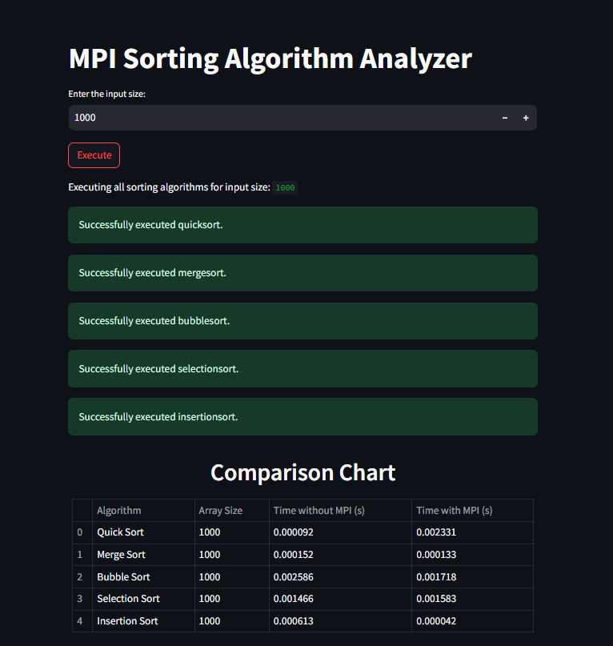

# MPI Sorting Algorithm Analyzer

This project is designed to run on a cluster of processors using the Message Passing Interface (MPI) protocol. The program generates a random array of integers, distributes the array to all the processors in the cluster, sorts the array using some sorting algorithm, and then gathers the sorted array back to the root node.
Displays a comparison of the time taken to sort the array using different sorting algorithms.

## Pre-requisites
- MPI <br>
<a href='https://www.youtube.com/watch?v=bkfCrj-rBjU&t=186s' target='_blank'>Installation</a>


## Installation
```bash
git clone git remote add origin https://github.com/atharvabhide/MPI-Sorting-Analyzer.git
cd MPI-Sorting-Analyzer
```

## Usage
```bash
streamlit run app.py
```

## Demo
<p align="center">
  
</p>